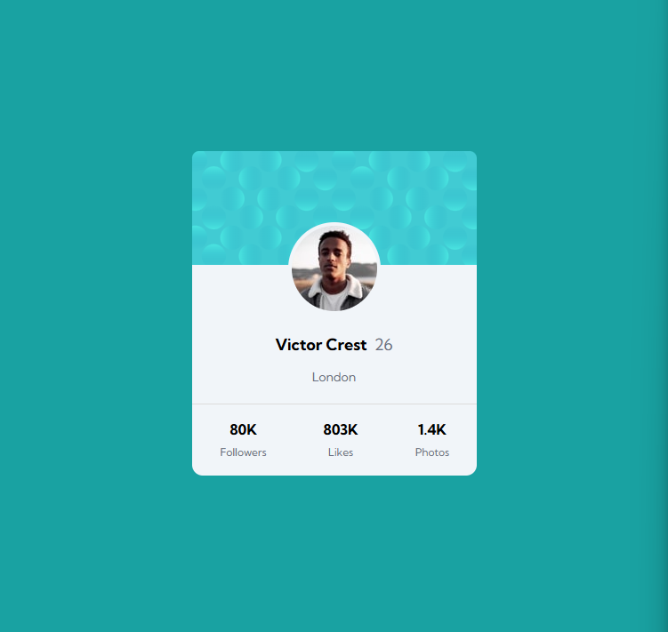

# Frontend Mentor - Profile card component solution

This is a solution to the [Profile card component challenge on Frontend Mentor](https://www.frontendmentor.io/challenges/profile-card-component-cfArpWshJ). Frontend Mentor challenges help you improve your coding skills by building realistic projects. 

## Table of contents

- [Overview](#overview)
  - [The challenge](#the-challenge)
  - [Screenshot](#screenshot)
- [My process](#my-process)
  - [Built with](#built-with)
  - [What I learned](#what-i-learned)
- [Author](#author)

## Overview

### The challenge

- Build out the project to the designs provided - was just a basic profile card component (Beginner Level) to practice some aligning and tailwindcss stuff

### Screenshot

### Links

- Solution URL: [Add solution URL here](https://your-solution-url.com)
- Live Site URL: [Add live site URL here](https://your-live-site-url.com)

## My process

### Built with
- Flexbox
- Mobile-first workflow
- [React](https://reactjs.org/) - JS library
- [Tailwindcss](https://tailwindcss.com/docs/guides/create-react-app) - For styling

### What I learned

 I took on this challenge as an opportunity to reinforce and enhance my understanding of Flexbox and Tailwind CSS. By applying these tools in a practical context, I aimed to solidify my knowledge, improve my skills
 
## Author

- Website - [Megha KL](https://www.your-site.com)
- Frontend Mentor - [@yourusername](https://www.frontendmentor.io/profile/yourusername)
 
